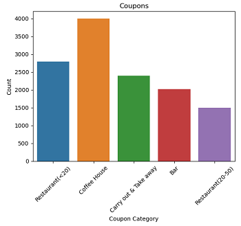
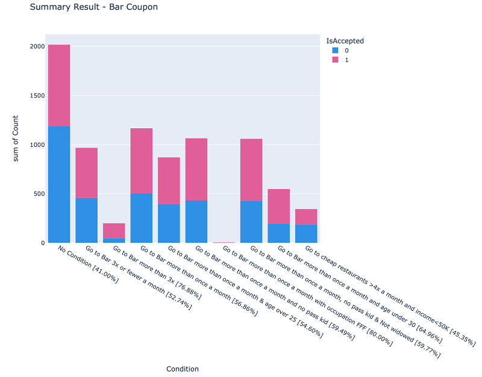
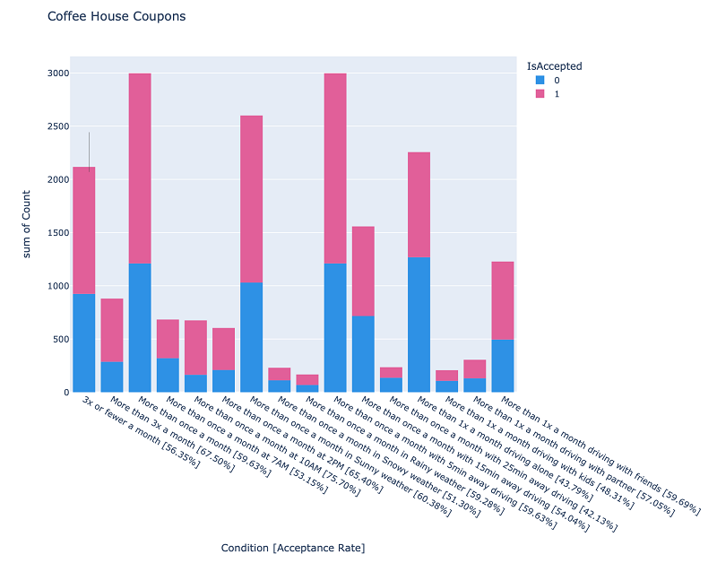

# Summary 

Before I started trying to understand about useful attributes from the source data, I first retrieved the data and checked to see if there was any missing data and do some data clean-up .

From the source, I was able to see there were several missing data:
- car: 12576
- Bar: 107
- CoffeeHouse: 217
- CarryAway: 151
- RestaurantLessThan20: 130
- Restaurant20To50: 189

## Data Clean-up

The 'car' attributes had too much missing data, so I decided to remove this 'car' column and for the rest of the missing attributes, I updated with 'never' because the meaning of missing data should be the same as 'never'.

## Findings

The 'Coupon' attribute is the important column that indicate the kind of coupon that customers received. The following chart shows the number of data for each coupon type.

### Investigation Result: Bar Coupon

The first investigation in this assignment is mainly focus on 'Bar' coupon and here is the result of my investigation:

- Proportion of Accepted Bar Coupon: 41.00%.
- Acceptance rate of Customers who went to a bar 3 or fewer times a month: 52.74%.
- Acceptance rate of Customers who went to a bar more than 3 times a month: 76.88%
- Acceptance rate of Customers who went to a bar more than once a month: 56.86%
- Acceptance rate of Customers who went to a bar more than once a month and age over 25: 54.60%
- Acceptance rate of Customers who went to a bar more than once a month and had passangers that were not a kid: 59.49%
- Acceptance rate of Customers who went to a bar more than once a month and had occupation of Farming, Fishing, & Forestry: 80.00%
- Acceptance rate of Customers who went to a bar more than once a month and had passangers that were not a kid and were not widowed: 59.77%
- Acceptance rate of Customers who went to a bar more than once a month and age under 30: 64.96%
- Acceptance rate of Customers who went to cheap restaurants more than 4 times a month and income is less than 50K: 45.35%

The following is the histogram chart that shows the above result:

### Investigation Result: Coffee House Coupon

For the second investigation, I picked Coffee House since it's the highest coupons that were given to customers. My investigation uses several attributes such as weather, time, location of users (time of driving), and passangers. 

Here is the result of the coupon acceptance rate of customers who went to Coffee House with several condition listed below:
- 3x or fewer a month: 56.35%.
- More than 3x a month: 67.50%.
- More than once a month: 59.63%.
- More than once a month at 7AM: 53.15%.
- More than once a month at 10AM: 75.70%.
- More than once a month at 2PM: 65.40%.
- More than once a month in Sunny weather: 60.38%.
- More than once a month in Snowy weather: 51.30%.
- More than once a month in Rainy weather: 59.28%.
- More than once a month with 5min away driving: 59.63%.
- More than once a month with 15min away driving: 54.04%.
- More than once a month with 25min away driving: 42.13%.
- More than once a month driving alone: 43.79%.
- More than once a month driving with kids: 48.31%.
- More than once a month driving with partner: 57.05%.
- More than once a month driving with friends: 59.69%.

The following is the histogram chart that shows the above result:

## Recommendation

Based on my investigation:
- Since the highest acceptance rate for Coffee House coupon is for customers that go more than once a month around 10AM, I think we should target more toward sending coupons to these customers.
- For the Bar coupon, I think we should target more toward sending coupons to custonmers that go to bar more than once a month with occupation of "Farming, Fishing and Forestry".

The 'prompt-solution.ipynb' contains a Jupyter Notebook that shows more details about my findings.

